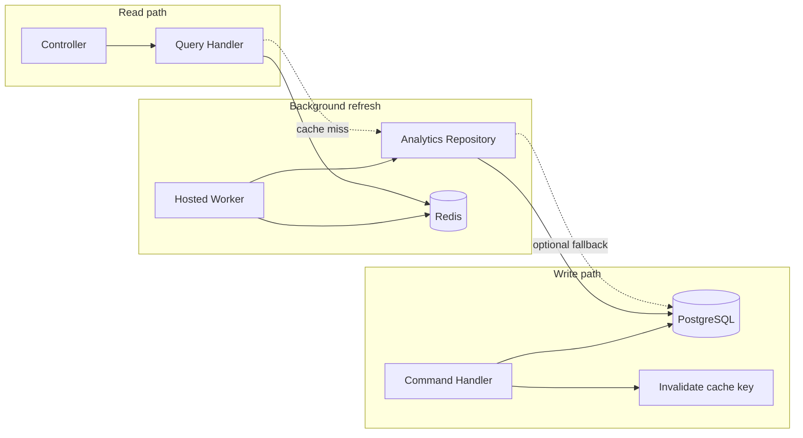

# Report Endpoints — Developer Guide

This document explains how to build **report / analytics / dashboard** endpoints in UMS without overloading PostgreSQL on every HTTP request.

The core idea:

1. A **background worker** (or scheduled job) runs expensive aggregations and **writes the result to Redis**.
2. The **HTTP endpoint stays the same** (controller → MediatR query → response contract) but the query handler **reads from Redis first**.
3. **Write endpoints** either invalidate the affected cache keys or trigger a refresh.

This is the recommended default for UMS. An alternative — **materialized report tables** — is documented at the end for cases where Redis alone is not enough.

---

## Why this matters

Report endpoints typically:

- Scan large tables (`GROUP BY`, `SUM`, joins across usher / attendance / reviews).
- Are called frequently (dashboards auto-refresh, multiple admins).
- Compete with transactional write traffic on the same database.

Running those queries on every `GET` will degrade API latency and DB connection pool usage. Pre-computing and caching moves that cost off the request path.

---

## Architecture



| Layer | Responsibility |
|-------|----------------|
| **Controller** | Auth, routing, sends MediatR query — no DB or Redis logic |
| **Query handler** | Cache-aside read: Redis → (optional) repository fallback |
| **Analytics repository** | Heavy read-only SQL / EF aggregation |
| **Background worker** | Periodically rebuilds report payloads and `SET`s Redis |
| **Command handlers** | After successful writes, `RemoveAsync` affected keys (or enqueue refresh) |

---

## What already exists in UMS

### Shared Redis abstraction

| Component | Location |
|-----------|----------|
| `ICacheService` | `src/UMS.Application/Common/Interfaces/ICacheService.cs` |
| `RedisCacheService` | `src/UMS.Infrastructure/Cache/RedisCacheService.cs` |
| DI registration | `src/UMS.Infrastructure/InfraDependencyInjection.cs` |
| Connection config | `Redis` section in `appsettings.json` |

```csharp
public interface ICacheService
{
    Task<T?> GetAsync<T>(string key, CancellationToken ct = default) where T : class;
    Task SetAsync<T>(string key, T value, TimeSpan expiry, CancellationToken ct = default) where T : class;
    Task RemoveAsync(string key, CancellationToken ct = default);
    Task RemoveByPatternAsync(string pattern, CancellationToken ct = default);
}
```

`RedisCacheService` serializes values as JSON, logs warnings on failure, and returns `null` on read failure (cache is treated as **best-effort**, not authoritative).

### Configuration

```json
"Redis": {
  "ConnectionString": "localhost:6379",
  "InstanceName": "UMS:"
}
```

`ConnectionString` is required. `InstanceName` is reserved for key prefixing (see [Improvements](#improvements-to-make-next) — not wired up yet).

### Cache keys and TTLs

Centralized in `src/UMS.Application/Common/CacheKeys.cs`:

| Key constant | Redis key | Used by |
|--------------|-----------|---------|
| `CacheKeys.AdminDashboard` | `admin:dashboard` | Admin dashboard summary |
| `CacheKeys.AdminAttendanceTrend` | `admin:attendance:trend` | Monthly attendance trend |
| `CacheKeys.AllEvents` | `prana:events:all` | External events list |

TTLs live in `CacheKeys.TTL` (e.g. `AdminDashboardDuration = 1 hour`).

### Reference implementation — Admin dashboard

**Endpoint** (`AdminDashboardController`):

- `GET /api/admin/dashboard/analytics` → `GetAdminDashboardQuery`
- `GET /api/admin/dashboard/attendance-trend` → `AttendanceTrendQuery`

**Query handler pattern** (`AdminDashboardQueryHandler`):

```csharp
// 1. Try cache
var cached = await cache.GetAsync<AdminDashboardResponse>(CacheKeys.AdminDashboard, ct);
if (cached is not null)
    return Result<AdminDashboardResponse>.Success(cached);

// 2. Cache miss — compute (ideally this moves to a background worker)
var response = await BuildReportAsync(ct);

// 3. Store with TTL
await cache.SetAsync(CacheKeys.AdminDashboard, response, CacheKeys.TTL.AdminDashboardDuration, ct);

return Result<AdminDashboardResponse>.Success(response);
```

**Heavy query** is isolated in `AttendanceAnalyticsRepository` (`GetMonthlyTrendAsync`) — not in the handler's inline LINQ when possible.

**Invalidation** after writes (example: `MarkAttendanceCommandHandler`):

```csharp
await cache.RemoveAsync(CacheKeys.AdminAttendanceTrend, cancellationToken);
```

---

## Recommended pattern for new report endpoints

Follow these steps for every new report.

### 1. Decide if it is a "report"

Treat an endpoint as a **report** when it:

- Aggregates across many rows (counts, averages, trends, exports).
- Joins multiple tables or calls external APIs as part of the response.
- Is read-heavy and tolerates slightly stale data (seconds to minutes).

CRUD list/detail endpoints should **not** use this pattern.

### 2. Add contracts

Define the response DTO in `UMS.Contracts` (e.g. `UMS.Contracts/Admin/Dashboard/`).

### 3. Add an analytics repository (if needed)

Put expensive EF/SQL in `UMS.Infrastructure/Persistence/Repositories/` behind an interface in `UMS.Application/Common/Interfaces/`.

Keep handlers thin: orchestration only, not 40-line LINQ blocks.

### 4. Register cache key and TTL

Add to `CacheKeys`:

```csharp
public static string MyNewReport => "admin:my-new-report";

public static class TTL
{
    public static readonly TimeSpan MyNewReport = TimeSpan.FromMinutes(15);
}
```

**Optional — store keys in app settings** for environment-specific naming:

```json
"ReportCache": {
  "Keys": {
    "AdminDashboard": "admin:dashboard",
    "AttendanceTrend": "admin:attendance:trend"
  },
  "TtlMinutes": {
    "AdminDashboard": 60,
    "AttendanceTrend": 60
  }
}
```

Bind with `IOptions<ReportCacheSettings>` when you need different key names per environment (e.g. `UMS:qa:admin:dashboard`). Until then, `CacheKeys` constants are fine.

### 5. Implement the query handler (read path)

```csharp
public sealed class GetMyReportQueryHandler(
    IMyAnalyticsRepository repository,
    ICacheService cache
) : IRequestHandler<GetMyReportQuery, Result<MyReportResponse>>
{
    public async Task<Result<MyReportResponse>> Handle(
        GetMyReportQuery query, CancellationToken ct)
    {
        var cached = await cache.GetAsync<MyReportResponse>(CacheKeys.MyNewReport, ct);
        if (cached is not null)
            return Result<MyReportResponse>.Success(cached);

        // Prefer: return stale-safe empty / 503 if worker-only mode is enabled
        var response = await repository.BuildAsync(ct);

        await cache.SetAsync(CacheKeys.MyNewReport, response, CacheKeys.TTL.MyNewReport, ct);
        return Result<MyReportResponse>.Success(response);
    }
}
```

**Target end state:** the handler only reads Redis. The block above that calls the repository on cache miss is a **transitional** cache-aside fallback until the background worker exists.

### 6. Add a background worker (write-to-cache)

Create a `BackgroundService` in `UMS.Infrastructure` (or a dedicated worker project):

```csharp
public sealed class ReportCacheRefreshWorker(
    IServiceScopeFactory scopeFactory,
    ILogger<ReportCacheRefreshWorker> logger
) : BackgroundService
{
    protected override async Task ExecuteAsync(CancellationToken stoppingToken)
    {
        while (!stoppingToken.IsCancellationRequested)
        {
            try
            {
                using var scope = scopeFactory.CreateScope();
                var repository = scope.ServiceProvider.GetRequiredService<IAttendanceAnalyticsRepository>();
                var cache = scope.ServiceProvider.GetRequiredService<ICacheService>();

                // Build each report and write to Redis
                var trend = await BuildAttendanceTrendAsync(repository, stoppingToken);
                await cache.SetAsync(
                    CacheKeys.AdminAttendanceTrend,
                    trend,
                    CacheKeys.TTL.AdminDashboardDuration,
                    stoppingToken);
            }
            catch (Exception ex)
            {
                logger.LogError(ex, "Report cache refresh failed");
            }

            await Task.Delay(TimeSpan.FromMinutes(5), stoppingToken);
        }
    }
}
```

Register in `Program.cs`:

```csharp
builder.Services.AddHostedService<ReportCacheRefreshWorker>();
```

| Concern | Guidance |
|---------|----------|
| **Interval** | 1–15 minutes for dashboards; align with `TTL` (refresh before expiry) |
| **Scope** | Always `IServiceScopeFactory` — repositories are scoped, worker is singleton |
| **Failure** | Log and continue; do not crash the host |
| **Startup** | Run one refresh immediately on start so first user does not pay cold-cache cost |

Extract `BuildAttendanceTrendAsync` into a shared service used by **both** the worker and (temporarily) the query handler to avoid duplicated logic.

### 7. Invalidate on writes

Every command that changes data reflected in a report must invalidate the related keys **after** the transaction commits:

```csharp
await cache.RemoveAsync(CacheKeys.AdminDashboard, ct);
await cache.RemoveAsync(CacheKeys.AdminAttendanceTrend, ct);
```

| Event | Keys to invalidate |
|-------|-------------------|
| Usher approved / rejected | `AdminDashboard` |
| Attendance marked | `AdminAttendanceTrend` (and `AdminDashboard` if it includes attendance) |
| Performance review submitted | `AdminDashboard` (average rating), `AdminAttendanceTrend` if coupled |

Prefer explicit `RemoveAsync` per key over `RemoveByPatternAsync` unless you have many parameterized keys (e.g. `report:schedule:{id}`).

### 8. Wire the controller

Same as any other feature — thin controller, `[Authorize]`, MediatR `ISender`, return `Ok(result.Value)`.

---

## Cache strategies (pick one per report)

### A. Background refresh + read from cache (recommended for UMS)

- Worker refreshes on a schedule.
- GET handler reads Redis only (or falls back on miss during rollout).
- Writes invalidate; worker repopulates on next cycle or you trigger immediate refresh.

**Pros:** Predictable DB load, fast GETs, simple mental model.  
**Cons:** Data can be stale for one refresh interval.

### B. Cache-aside on demand (current transitional state)

- First GET after invalidation runs the heavy query and populates Redis.
- Subsequent GETs are fast until TTL or invalidation.

**Pros:** Always correct after invalidation; no worker yet.  
**Cons:** First user after invalidation pays full query cost; thundering herd if many users hit at once.

### C. Write-through report tables (alternative)

See [Materialized report tables](#alternative-materialized-report-tables) below.

---

## Staleness and failure behavior

| Scenario | Behavior |
|----------|----------|
| Redis down | `GetAsync` returns `null` → handler falls back to DB (if implemented) or returns degraded/503 |
| Cache empty | Worker should fill on startup; optional sync build on first miss |
| Write + invalidation | Key removed; next read miss or worker refresh rebuilds |
| TTL expiry | Key disappears; same as empty cache |

Document the **maximum staleness** in the endpoint's API notes (e.g. "up to 5 minutes behind live data").

---

## Alternative: materialized report tables

Instead of (or in addition to) Redis, maintain **denormalized report tables** in PostgreSQL:

```text
usher_attendance_report_daily (usher_id, date, score, ...)
admin_dashboard_snapshot (total_approved, total_pending, avg_rating, refreshed_at)
```

### Update strategies

1. **Synchronous on write** — command handler updates report row in the same transaction as the domain write.
2. **Async via outbox / queue** — write endpoint publishes event; consumer updates report tables.
3. **Scheduled SQL job** — `REFRESH MATERIALIZED VIEW` or batch recompute (similar to Redis worker).

### When to prefer report tables

- Reports need **historical snapshots** or auditability.
- Result sets are too large for Redis strings (e.g. full CSV export).
- You need **SQL-level querying** of the report itself.
- Stronger durability than Redis TTL.

### When to prefer Redis (UMS default)

- Dashboard JSON blobs, small/medium payloads.
- Fast read path, shared with existing `ICacheService`.
- Easy invalidation per key.
- Already integrated for admin dashboard and Prana events.

### Hybrid

Worker writes to **both** a report table (source of truth / history) and Redis (fast read path). GET reads Redis; table is fallback if cache is cold.

---

## Checklist for new report endpoints

- [ ] Response DTO in `UMS.Contracts`
- [ ] Analytics logic in a repository interface, not in the controller
- [ ] Cache key + TTL added to `CacheKeys` (or `ReportCache` settings)
- [ ] Query handler reads `ICacheService` first
- [ ] Background worker entry to rebuild this report (or documented reason for cache-aside only)
- [ ] All related command handlers call `RemoveAsync` on the correct keys
- [ ] Authorization on controller (`[Authorize(Roles = "...")]`)
- [ ] Staleness documented for API consumers
- [ ] Redis added to local `docker-compose` if testing reports locally

---

## Improvements to make next

These are gaps in the current codebase relative to the target pattern:

1. **No `BackgroundService` yet** — admin reports use cache-aside on first request only. Add `ReportCacheRefreshWorker` as described above.

2. **`Redis:InstanceName` not applied** — keys are stored as `admin:dashboard` without the `UMS:` prefix. Prefix all keys in `RedisCacheService` (or a key builder) to avoid collisions on shared Redis instances.

3. **Incomplete invalidation** — `AdminDashboard` is not invalidated when usher counts or ratings change (only `AdminAttendanceTrend` is cleared in some handlers). Map each write operation to **all** affected keys.

4. **`CacheKeys` namespace** — file lives under `UMS.Application/Common/` but uses namespace `UMS.Infrastructure.Cache`. Move to `UMS.Application.Common` for clean layering.

5. **Redis not in `docker-compose.yml`** — local stack has Postgres and MinIO but not Redis; add a `redis` service and `Redis__ConnectionString` to `.env.example` for local report testing.

6. **Shared report builder** — extract trend/dashboard build logic from query handlers into `IReportCacheBuilder` so worker and handler do not duplicate code.

---

## File map (quick reference)

```
UMS.api/Controllers/AdminDashboardController.cs     # HTTP endpoints
UMS.Application/Features/Admin/Queries/Dashboard/   # Query + handlers
UMS.Application/Common/Interfaces/ICacheService.cs  # Cache abstraction
UMS.Application/Common/CacheKeys.cs                 # Key names + TTLs
UMS.Infrastructure/Cache/RedisCacheService.cs       # Redis implementation
UMS.Infrastructure/Persistence/Repositories/
    AttendanceAnalyticsRepository.cs                # Heavy attendance SQL
UMS.Infrastructure/InfraDependencyInjection.cs    # Redis + ICacheService DI
```

---

## Summary

| Concern | Approach |
|---------|----------|
| Expensive reads | Pre-compute in background worker → Redis |
| HTTP layer | Unchanged: Controller → MediatR → contract DTO |
| Cache access | Inject `ICacheService`; keys in `CacheKeys` or app settings |
| Writes | Invalidate affected keys after commit |
| Alternative | Materialized report tables when Redis is not enough |

New report work should **not** add heavy aggregation directly on the GET request path without a cache or report table in front of it.
